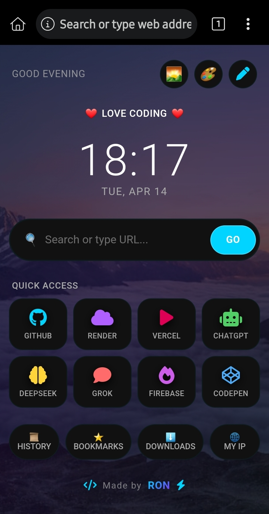
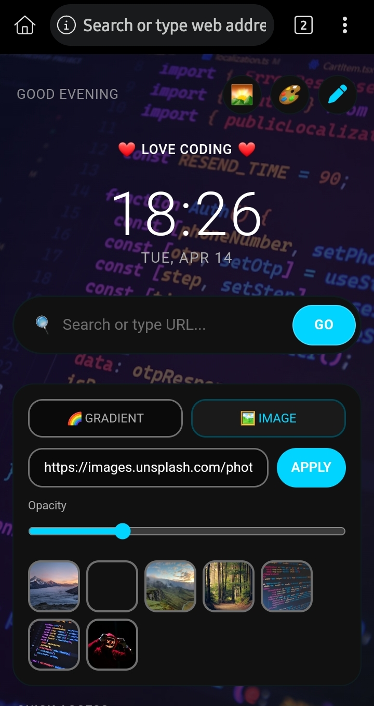
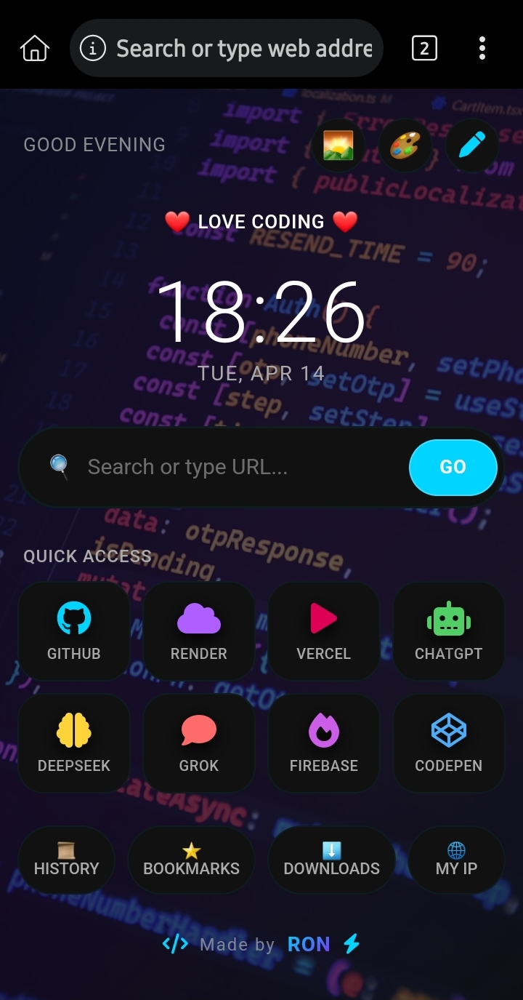

# 🚀 VOID OS 🔥
> Futuristic Hacker New Tab Dashboard for Chrome 💻⚡

---

## ⚡ About

VOID OS is a **next-gen Chrome New Tab extension** built for developers, coders, and hacker mindset users 😏  

It transforms your boring browser into a **fully customizable cyberpunk dashboard** with powerful tools, stunning UI, and lightning-fast access ⚡  

---

## 🖼️ Preview

### 🧠 Main Dashboard

### 🎨 Customization System

### ⚙️ Tools & Popups

---

## ✨ Features

### 💻 Hacker Style UI
- Futuristic cyberpunk design 🔥  
- Neon glow + glassmorphism effects ✨  
- Smooth animations & transitions  
- Clean & distraction-free layout  

---

### ⚡ Smart Dashboard
- 🕒 Live clock & date  
- 🌅 Auto greeting system (Morning / Afternoon / Evening)  
- 🔍 Smart search (URL + Google search detection)  
- ⚡ Fast navigation experience  

---

### 🎯 Quick Access Dials
- Add unlimited shortcuts 🚀  
- Edit / delete / customize anytime  
- Support for:
  - 🎨 Font Awesome icons  
  - 😄 Emoji icons  
- Custom icon colors 🌈  

---

### 🎨 Full Customization
- Dynamic gradient backgrounds 🌈  
- Custom image backgrounds 🖼️  
- Opacity control  
- Theme color system:
  - Primary  
  - Secondary  
  - Tertiary  
- Icon color palette control  

---

### 🧰 Built-in Tools
- 📜 History viewer  
- ⭐ Bookmarks viewer  
- ⬇️ Downloads manager  
- 🌐 Public IP finder  

(All powered via Chrome APIs ⚡)

---

### 🧠 Advanced System
- Chrome Manifest V3 ready ✅  
- Secure (CSP compliant) 🔒  
- Background service worker integration  
- LocalStorage based persistence 💾  

---

### 🎮 UX Features
- Edit mode toggle ✏️  
- Modal-based UI system  
- Popup system with smooth transitions  
- Responsive & fast ⚡  

---

## 🛠️ Installation

1. Download / Clone this repo
2. Go to: chrome://extensions/
3. Enable **Developer Mode**
4. Click **Load unpacked**
5. Select project folder

🔥 Done! Your new tab is now VOID OS 😎  
